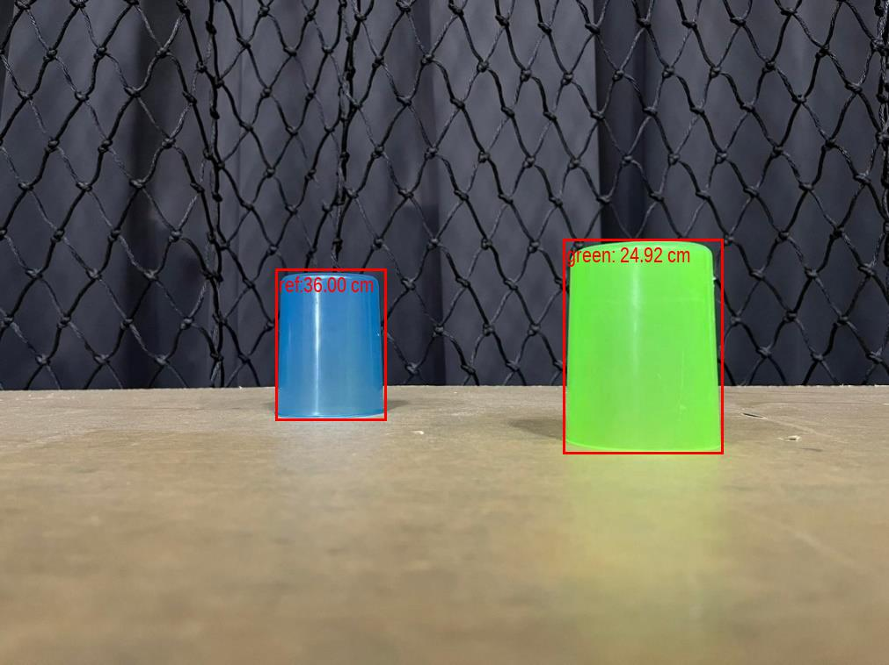

# measure-object-distance
````
```pseudo-code

- Find objects in the image and bounding boxes for each object. 
    #use pre train model form torchvision(retinanet_resnet50_fpn)
    #select only objects with a score greater than .5 to focus only on blue and green objects and draw bounding boxes in picture
    
- Find out which box is a reference object. (blue object) 
    #now we find a blue object and a green object. Crop each object to check. If it's a blue object, specify it as a ref object.
    #condition is if ฺblue channel value greater than green channel value then this object is blue object
    #In fact, the image should be HSV type. because it can clearly distinguish between blue and green but notice in RGB type, 
    blue channel value alway greater than green channel value.
    #ref:http://www.workwithcolor.com/cyan-color-hue-range-01.htm
````
$\frac{F}{D} = \frac{P}{W}$

where 
- F = focal length
- D = Distance (unit: cm)
- P = object width in pixels
- W = object width in cm.

ref: [link1](https://stackoverflow.com/questions/6714069/finding-distance-from-camera-to-object-of-known-size), [link2](https://pyimagesearch.com/2015/01/19/find-distance-camera-objectmarker-using-python-opencv/), [link3](https://github.com/Asadullah-Dal17/Distance_measurement_using_single_camera/blob/main/distance.py)
````
- Calculate focal length and Distance
    #from formula above, We know D, W and P of ref object.(P get from bounding boxes'ref object ) Then we can calculate focal length.
    #์Now, we have F and W then use P of green object. We'll get D' (Distance of  green object)
- Display the distance to each objects.	
    #Last,  Draw bounding boxes and add distance for each object as text on picture.
```
````

# result

